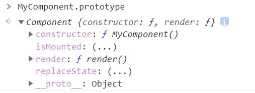
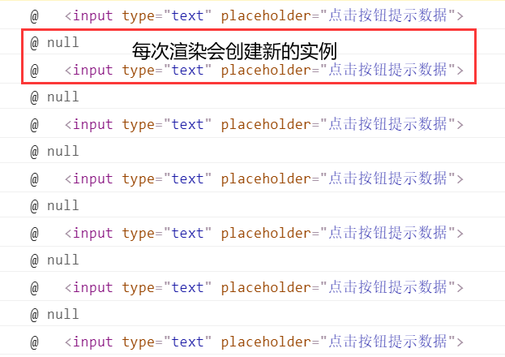
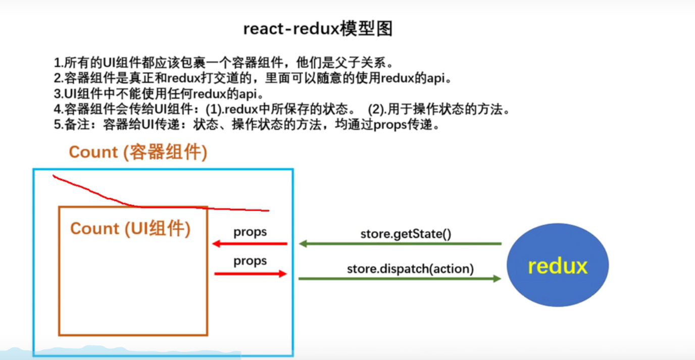

# 	React

- 用于构建**用户界面**的 JavaScript 库。

- 发送请求获取数据
  - 处理数据
  - 操作DOM呈现页面（react自行处理）
  ~~~
  是一个将数据渲染为 HTML 视图的开源 JavaScript 库。
  
- 由 Facebook 开发，且开源。

- 为什么要学？

  - 原生 JavaScript 操作 DOM 繁琐、效率低(**DOM-API操作UI**)。

    ~~~ javascript
    document.getElementById('app');
    document.querySelect('#app');
    document.getElementsByTagName('span');
    ~~~

  - 使用 JavaScript 直接操作 DOM，浏览器会进行大量的**重绘重排**。

  - 原生 JavaScript 没有**组件化**（js模块化）编码方案，代码复用率低。

- ==React的特点==：

  - 采用**组件化**模式、**声明式编码**，提高开发效率及组件复用率。

    > - 命令式编码
    > - 声明式编码

  - 在 React Native 中可以使用 React 语法进行**移动端开发**。

  - 使用**虚拟DOM**+优秀的**Diffing算法**，尽量减少与真实DOM的交互。

    > - 虚拟 DOM：运行先放在内存中。
    > - 先进行虚拟 DOM 的比较，再在页面渲染真实DOM。

---


# 1 React入门
  ## 1.1 React简介

- 官网
  - [英文官网](https://reactjs.org/)
  - [中文官网](https://react.docschina.org/)

- 用于构建用户界面的 JavaScript 库（只关注于视图操作）。

- 特点：

  - 声明式编程
  - 组件化编程
  - React Native 编写原生应用
  - **高效（优秀的Diffing算法）**

- **React 高效的原因**：
  - 使用虚拟DOM，不总是直接操作页面真实DOM。
  - DOM Diffing算法，最小化页面重绘。

## 1.2 React基本使用

- 效果

  ~~~ html
  <!-- 准备好一个容器 -->
  <div id="test"></div>
  
  <!-- 引入 react 核心库 -->
  <script src="https://cdn.staticfile.org/react/16.4.0/umd/react.development.js"></script>
  <!-- 引入 react-dom 用于支持 react 操作 DOM -->
  <script src="https://cdn.staticfile.org/react-dom/16.4.0/umd/react-dom.development.js"></script>
  <!-- 引入 babel 用于将 jsx 转为 js -->
  <script src="https://cdn.staticfile.org/babel-standalone/6.26.0/babel.min.js"></script>
  
  <script type="text/babel"> /* 此处一定为babel*/
      // 1. 创建虚拟DOM
      // 此处一定不要写引号，因为此处是虚拟DOM，不是字符串
      const VDOM = <h1>Hello, React</h1>;
      // 2. 渲染虚拟DOM到页面
      // ReactDOM.render(虚拟DOM, 容器)
      ReactDOM.render(VDOM, document.getElementById('test'));
  </script>
  ~~~

  

- 相关js库

  - babel.min.js : [ES6 ==> ES5] JSX ==> JS
  - react.development.js : react核心库
  - react-dom.development.js : react扩展库

- 创建虚拟DOM的两种创建方式

  - JSX：**更加简单的创建虚拟 DOM**。

    ~~~ html
    <script type="text/babel"> /* 此处一定为babel*/
        // 1. 创建虚拟DOM
        const VDOM = (
            <h1>
            	<span>Hello, React</span>
            </h1>
        );
        // 2. 渲染虚拟DOM到页面
        // ReactDOM.render(虚拟DOM, 容器)
        ReactDOM.render(VDOM, document.getElementById('test'));
    </script>
    ~~~

  - JavaScript

    `React.createElement(标签名，标签属性，标签内容);`
    
    ~~~ html
    <script type="text/javascript">
        // 1. 创建虚拟DOM
        const VDOM = React.createElement('h1', {id:'title'}, 'Hello React');
    
        // 2. 渲染虚拟DOM到页面
        // ReactDOM.render(虚拟DOM, 容器)
        ReactDOM.render(VDOM, document.getElementById('test'));
    </script>
    ~~~

- 虚拟DOM与真实DOM

  ~~~ javascript
  console.log('虚拟DOM', VDOM);
  console.log(typeof(VDOM));
  console.log(VDOM instanceof Object);
  
  const TDOM = document.getElementById('demo');
  console.log('真实DOM', TDOM);
  debugger;
  ~~~
  
  ==关于虚拟DOM:==
  
  1. 本质是 Object 类型的对象。
  2. 虚拟 DOM 比较“轻”，真实 DOM 比较“重”，因为虚拟 DOM 是 React 内部再用，无需真实 DOM 那么多属性。
  3. 虚拟 DOM 最终会被 React 转化为真实 DOM，呈现在页面上。

## 1.3 JSX

- 全称 JavaScript XML.

- react 定义的一种类似于 XML 的 JS 扩展语法。

  - XML 早期用于存储和传输数据。

  ```xml
  <student>
  	<name>TOM</name>
      <age>19</age>
  </student>
  ```

  - 现在用 JSON 存储数据。

  ```json
  "{"name":"TOM","age":19}"
  ```

  

- ==本质是`React.createElement(component, props, ...children)方法的语法糖`==。

- **作用：用来简化创建虚拟 DOM。**

- 标签名任意：HTML 标签或其它标签

  ~~~ html
  <script type="text/babel"> /* 此处一定为babel*/
          const myId = 'atguigu';
          const myData = 'Hello, reaCt';        
          
          // 1. 创建虚拟DOM
          // 变量
          const VDOM = (
              <h2 className="title" id={myId.toLowerCase()}>
                  <span style={{color:'red'}}>{myData.toLowerCase()}</span>
                  <span style={{color:'red'}}>{myData.toLowerCase()}</span>
                  <input type="text"></input>
      		</h2>
          );
          
          // 2. 渲染虚拟DOM到页面
          // ReactDOM.render(虚拟DOM, 容器)
          ReactDOM.render(VDOM, document.getElementById('test'));
  </script>
  ~~~

  ==JSX语法规则：==

  1. 定义虚拟DOM时，不要写引号，因为它不是字符串 。

  2. **标签中混入==js表达式==时，要用{}**。

     ~~~ jsx
     // 大括号内放置任何有效的js表达式
     
     const name = 'yuan';
     const element = <h1>hello, {name}</h1>;
     
     ReactDOM.render(
     	element, 
         docuemnt.getElementById('root')
     )
     
     
     /*example 2*/
     function formatName(user) {
       return user.firstName + ' ' + user.lastName;
     }
     
     const user = {
       firstName: 'Harper',
       lastName: 'Perez'
     };
     
     const element = (
       <h1>
         Hello, {formatName(user)}!
       </h1>
     );
     
     ReactDOM.render(
       element,
       document.getElementById('root')
     );
     ~~~
     
     

  3. 样式的类名指定不能用class，要用**className**。

  4. **内联样式，要用style={{key:value}}的形式去写**。

     - 外边表示写的是 js 表达式；
     - 里边表示写的是对象形式。

  5. 只有一个根标签。

  6. **标签必须闭合 （JSX标签）**。

  7. 标签首字母：

     > - 小写的转换成 HTML 标签。
     > - 大写开头，react就去渲染对应的组件，若组件没有定义，则报错。

- 练习

  动态展示列表

  ~~~ jsx
  const data = ['Angular', 'Vue', 'React'];
  const VDOM = (
      <div id="container">
          <h2>展示前端框架</h2>
          <ul>
              {
                  data.map((item, index) => {
                      return <li key={index}>{item}</li>
                  })
              }
          </ul>
  	</div>
  )
  
  ReactDOM.render(VDOM, document.getElementById('root'));
  ~~~

  **一定注意区分：JS 语句（代码）与 JS 表达式。**

  - 表达式：一个表达式会产生一个值，可以放在任何一个需要值的地方。

    >1. a
    >2. a + b
    >3. demo(1)
    >4. arr.map()
    >5. function test (){}

  - 语句·：

    > 	1. if(){}
    >  	2. for(){}
    >  	3. switch(){}

---

## 1.4 模块与组件、模块化与组件化的理解

- 模块
  - 向外提供特定功能的 JS 程序,一般就是一个 JS 文件。
  - 复用 JS，简化 JS 编写，提高 JS 运行效率。
- 组件
  - 用来实现局部功能效果的**代码和资源（font、video、img 等）**的集合。
  - 复用编码，简化项目编码，提高运行效率。
- 模块化|组件化|工程化。

---

# 2 面向组件编程

## 2.1 函数式组件&类式组件

- **函数式组件**——适用于简单组件

  - 简单组件——无state

  ~~~ jsx
  // 1. 创建函数式组件——首字母大写
  function Demo(){
      console.log(this); // undefined
      // babel翻译完开启严格模式，所以为 undefined
      return <h2>我是用函数定义的组件</h2>;
  }
  // 函数调用： Demo()
  
  // 2. 渲染组件到页面——react调用
  ReactDOM.render(<Demo/>, document.getElementById('test'));
  ~~~

  执行ReactDOM.render()之后，发生了什么？

  1. React 解析组件标签，找见 Deme 组件。
  2.  发现组件是使用**函数**定义的，随后**调用**该函数，将返回的虚拟 DOM 转为真实 DOM，呈现在页面。

- **类式组件**——适用于复杂组件

  - 复杂组件——有state
  
  ~~~ jsx
  // 1. 创建类式组件
  class MyComponent extends React.Component {
      render() {
          // render是放在类的原型对象上，供实例使用
          /*  
            MyComponent.prototype
              constructor: ƒ MyComponent()
              render: ƒ render()
              [[Prototype]]: Object
          */
          // render中的this是—— MyComponent组件实例对象
          console.log(this);
          return <h2>我是用类式定义的组件</h2>
      }
  }
  
  // 2. 渲染组件到页面
  ReactDOM.render(<MyComponent/>, document.getElementById('test'));
  ~~~
  
  执行了ReactDOM.render之后，发生了什么？
  
  - React 解析组件标签，找到了 MyComponent 组件。
  - 发现组件是使用**类**定义的，随后 **new** 出来该类的实例，并通过该实例调用到原型上的render 上。
  - 将 render 返回的虚拟DOM转为真实DOM，随后呈现在页面上。



## 2.1_补充类的基本知识	

~~~ html
<script type=text/javascript>
    // 创建一个Person类
    class Person {
        // 构造器方法
        constructor(name, age){
            // 构造器中的this是指——类的实例对象
            this.name = name;
            this.age = age;
        }
        // 一般方法
        speak(){
            // 放在了类的原型对象上 prototype
            // 通过person实例调用speak时，speak中的this就是person实例
            console.log(`我叫${this.name},我年龄是${this.age}`);
        }
    }
    // 创建一个Person的实例对象
    const p1 = new Person('tom', 10);
    const p2 = new Person('fas', 30);

    console.log(p1);
    console.log(p2);
    p1.speak();
    p2.speak();
</script>
~~~

## 2.2 类组件实例的三大核心属性1: state[状态]

- 实例练习。

~~~ javascript
// 1. 创建组件
class Weather extends React.Component{
    // 初始化状态
    state = {
        isHot : true,
        wind : '微风'
    };
 	// 自定义方法
    changeWeather = ()=>{
        const isHot = this.state.isHot;
        this.setState({
            isHot : !isHot
        })
	}

    render(){
        const {isHot, wind} = this.state;
        return <h1 onClick={this.changeWeather} id='title'>今天天气很{isHot ? '炎热' : '凉爽'}, {wind}</h1>
    }
}

// 2. 渲染组件到页面
ReactDOM.render(<Weather/>, document.getElementById('container'))
~~~

- 理解
  - state 是组件对象最重要的属性，值是对象。
  - 组件被称为“状态机”，通过更新组件的state来更新对应的页面显示（重新渲染组件）。
  
  > 人的状态不好，考试没考好；即状态驱动着行为。
  >
  > 组件的状态驱动着组件的行为。
  >
  > 数据放在组件的状态中。
  
- **强烈注意**
  
  - 组件中 render 方法中的this为组件实例对象。
  - 组件自定义的方法中this为Undefined, 如何解决？
    - 强制绑定  this : `bind()`。
    - 箭头函数。
  - 状态数据，不能直接修改或更新，用 `setState()`。

## 2.2_补充 

- 原生JS点击事件

~~~ html
<button id="btn1">按钮1</button>
<button id="btn2">按钮2</button>
<button onclick="demo()">按钮3</button>

<script>
    const btn1 = document.getElementById('btn1');
    btn1.addEventListener('click', ()=> {
        alert('按钮1被点击')
    })

    const btn2 = document.getElementById('btn2');
    btn2.onclick = ()=>{
        alert('按钮2被点击');
    }

    function demo(){
        alert('按钮3被点击');
    }
</script>
~~~

- bind

~~~ javascript
function demo(){
    console.log(this);
}
demo(); // this : window

// 直接调用
const x = demo.bind({a:1, b:2})
x(); // Object
~~~

- 类中this指向

~~~ javascript
class Person{
    constructor(name, age){
        this.name = name;
        this.age = age;
    }
    speak (){
        // speak放在了类的原型对象上，供实例使用
        // 通过Person实例调用speak时，speak中的this就是person实例
        console.log(this);
    }
}

const p1 = new Person('tom', 10);
p1.speak(); // this —— person

const x = p1.speak;
// 直接调用
// 类中 this 开启局部严格模式，为 undefined。
x(); // this —— undefined
~~~

- 类的知识

~~~ javascript
class Car {
    constructor (name, price){
        this.name = name;
        this.price = price;
    }
    // 类中可以直接写赋值语句，如下代码含义是：给Car 的实例对象添加一个属性，名为wheel, 值为4
    wheel = 4;
}
const c1 = new Car('奔驰', 199);
const c2 = new Car('宝马', 199);
console.log(c1);
console.log(c2);
~~~

## 2.3 组件实例的三大核心属性2: props

- 需求：自定义用来显示一个人员信息的组件

- 类式组件：

  ~~~ jsx
  // 1. 创建组件
  class Person extends React.Component{
      constructor(props) {
          // 构造器是否接收props，是否传递给super，取决于是否希望在构造器中通过this访问props
          super();
          // 如果不 super(props),则 this.props --- undefined
      }                                           
      /* 
        构造函数：
          1. 通过this.state 复制对象来初始化内部 state
          2. 为事件处理函数绑定事件
       */
  
      // 对标签属性进行类型、必要性的限制
      static propTypes = {
          // 字符串必填
          name : PropTypes.string.isRequired,
          sex : PropTypes.string,
          age : PropTypes.number,
      }
      // 指定默认标签属性值
      static defaultProps = {
          sex : '男', // 指定默认值
          age : 18
      }
  
      render (){
          const {name, age, sex} = this.props;
          // props是只读的
          return (
              <ul>
                  <li>姓名：{name}</li>
                  <li>性别：{sex}</li>
                  <li>年龄：{age + 1}</li>
              </ul>
          )
      }
  }
  
  // 2. 渲染组件到页面
  ReactDOM.render(<Person name="tom"/>, document.getElementById('container'))
  ~~~
  
- 函数式组件

  ~~~ javascript
  function Person (props){
      const {name, sex, age} = props;
      return (
          <ul>
          	<li>姓名：{name}</li>
              <li>性别：{sex}</li>
              <li>年龄：{age}</li>
  		</ul>
  	)
  }
  // 对标签属性进行类型、必要性的限制
  Person.propTypes = {
      // 字符串必填
      name : PropTypes.string.isRequired,
      sex : PropTypes.string,
      age : PropTypes.number,
  }
  // 指定默认标签属性值
  Person.defultProps = {
      sex : '男', // 指定默认值
      age : 18
  }
  // 2. 渲染组件到页面
  ReactDOM.render(<Person name="tom" sex="女" age={12}/>, document.getElementById('container'))
  ~~~

- 理解

  - 每个组件对象都有`props`属性。
  - 组件标签的所有属性都保存在`props`中。

- 作用

  - **通过标签属性从组件外像组件内传递变化的数据**。
  - 组件内部不要修改props数据，**props只读，不能修改**。

- 编码操作

  - 内部读取某个属性值。

    ~~~ javascript
    this.props.name
    ~~~

  - 对props中的属性值进行类型限制和必要性限制。

    ~~~ html
    <!-- 引入prop-types, 用于对组件标签属性进行限制 -->
    <script src="https://cdnjs.cloudflare.com/ajax/libs/prop-types/15.6.0/prop-types.js"></script>
    ~~~
    
    ```jsx
    // 对标签属性进行类型、必要性的限制
    Person.propTypes = {
        // 字符串必填
        name : PropTypes.string.isRequired,
        sex : PropTypes.string,
        age : PropTypes.number,
        speak : PropTypes.func
    }
    // 指定默认标签属性值
    Person.defaultProps = {
        sex : '男', // 指定默认值
        age : 18
    }
    ```
    
    
    
  - 扩展属性：将对象的所有属性通过props传递。
  
  - 默认属性值
  
    ~~~ javascript
    Person.defaultProps = {
        age : 18,
        sex : "男"
    }
    ~~~
  
  - 组件类的构造函数
  
    ~~~ js
    constructor(props){
        super(props);
    }
    ~~~
  


## 2.3_ 补充 展开运算符

~~~ javascript
let arr1 = [1, 3, 4, 22,45, 3];
let arr2 = [0, 2, 3]
console.log(arr1);
// 展开数组
console.log(...arr1);

// 连接数组
let arr3 = [...arr1, ...arr2];
console.log(arr3);

// 函数传参
function sum(...numbers){
    // numbers ---> Array
    return numbers.reduce((preValue, currentValue)=>{
        return preValue + currentValue;
    })
}
console.log(sum(1, 2));

// 展开运算符不能展开对象
let person = {
    name : 'tom',
    age : 18
}
// console.log(...person); 

// 构造字面量对象时使用展开语法
let person2 = {...person};
person.name = 'jerry';
console.log(person2); // {name: "tom", age: 18}
console.log(person); // {name: "jerry", age: 18}

// 复制对象时修改属性  合并
let person3= {...person, name : 'jack'}
console.log(person3);
~~~

## 2.3_ 补充

在 React 中，构造函数仅用于一下两种情况:

- 通过 `this.state` 赋值对象来初始化`内部state`。

- 为事件处理函数绑定实例。

  ```jsx
  this.changeWeather = this.changeWeather.call(this);
  ```

  


## 2.4 组件实例的三大核心属性3：refs与事件处理

- 理解

  组件内的标签可以定义ref属性来**标识自己**。

- 编码

  - 字符串形式的ref [不被推荐，过时，存在效率问题]

    ~~~ javascript
    <input ref="input1" />
    ~~~

    

  - 回调形式的ref：内绑定|内联
  
    ```javascript
    <input ref={(c)=>{this.input1 = c}} />
    ```
  
    ```jsx
    showInfo = () => {
        console.log(this.input1.value);
    }
    ```
    
    
    
    ==执行次数问题==
    
    如果 ref 回调函数是以**内联函数**的方式定义的，在**更新过程**中它会被**执行两次**，**第一次传入参数null, 然后第二次会传入DOM元素**。
    
    这是因为在每次渲染时会创建一个新的函数实例，所以React清空旧的ref并且设置新的。
    
    通过将ref的回调函数定义成 `class 的绑定函数`的方式可以避免上述问题，但大多情况下无关紧要。
    
    ```jsx
    // 类绑定
    <input ref={this.saveInput} type="text" />
    saveInput = (c) => {
        this.input1 = c;
    }
    ```
    
    
    
    
  
  ---
  
    - createRef 创建 ref 容器。
  
      `React.createRef` 调用后可以返回一个容器，该容器可以存储被ref所标识的节点。
  
      专人专用。
  
  ``` javascript
   myRef = React.createRef();
  <input ref={this.myRef} />
  ```
  
  ~~~ javascript
  // 创建组件
  class Demo extends React.Component{
      myRef = React.createRef();
      // this.myRef.current.value
      render(){
          return (
              <div>
                  <input ref={this.myRef} type="text" />       
                  <button ref="button123" onClick={this.showData}>点我提示数据</button>  
     	 		</div>
      	)
  	}
  }
  ~~~
  
  
  
- react 中的事件处理

  通过onXxx属性指定事件处理函数

  - React 使用的是自定义事件，而不是原生的DOM事件。
  - React 中的事件是通过**事件委托**方式处理的（**委托给组件最外层的元素**）

  通过`event.target`得到发生时间的 DOM 元素对象 —— 不要过度使用refs。

  


## 2.5 受控组件&非受控组件

- 效果练习：

  定义一个包含表单的组件，输入用户名和密码之后，点击登录有弹框提示。

- 理解

  - 受控组件，约等于根据双向数据绑定，获取数据。

    优势：能够省略掉 ref 的使用。
  
  - 非受控组件 : 
  
    输入类组件，现用现取。

## 2.6 高阶函数&函数柯里化

**高阶函数**：如果一个函数符合下面2个规范中的任何一个，那该函数就是高阶函数

    1. 若A函数，接受的参数是一个函数，那么A就可以成为高阶函数
    2. 若A函数，调用的返回值依然是一个函数，那么A就可以称之为高阶函数
    3. 常见的高阶函数：Promise、setTimeout、arr.map()
**函数的柯里化**：通过函数调用继续返回函数的方式，实现多次接收参数最后统一处理的函数编码形式。

~~~ javascript
// 保存表单数据到状态中
saveFormData = (dataType)=>{
    // 返回的是一个函数
    return (event)=>{
        this.setState({
            // 统一处理 dataType event
            [dataType] : event.target.value
        })
    }
}
~~~

```jsx
<input 
    onChange={this.saveFormData('username')} 
    type="text" 
    name="username" /> 
```


- 不用函数柯里化的实现

~~~ javascript
saveFormData = (dataType, event)=>{
    this.setState({
        [dataType] : event.target.value
    })
}
~~~

```jsx
<input 
    onChange={(event)=>{this.saveFormData('username', event)}} 
    type="text" 
    name="username" />  
```

- 函数柯里化

```js
// 函数柯里化
function sum_num(a){
    return (b) => {
        return (c) => {
            return a+b+c;
        }
    }
}
const res = sum_num(1)(2)(3);
```


## 2.7 组件生命周期

- 理解

  1. 组件对象从创建到死亡会经历特定阶段。
  2. React 组件对象包含一系列钩子函数（生命周期回调函数），在特定的时刻调用。
  3. 我们在定义组件时，在特定的生命周期回调函数中做特定的工作。
  3. [组件生命周期](https://react.docschina.org/docs/react-component.html)

- **组件生命周期（旧）**

  - **初始化阶段**：由 `ReactDOM.render()` 触发 --- 初次渲染

    1. `constructor()`

       **如果不初始化 state 或不进行方法绑定，则不需要为 React 组件实现构造函数。**

       ```jsx
       constructor(props) {
           super(props);
           // 不要在这里调用 this.setState()
           this.state = { counter: 0 };
           this.handleClick = this.handleClick.bind(this);
       }
       ```
  
       
  
    2. `componentWillMount()`

       

    3. `render()`
  
       `render()` 函数应该为纯函数，这意味着在不修改组件 state 的情况下，每次调用时都返回相同的结果，并且它不会直接与浏览器交互。
  
    4. **`componentDidMount()` ==> 常用**
  
       一般在这个钩子做一些**初始化**的事，例如：开启定时器、发送网络请求、订阅请求
  
  - **更新阶段**：由组件内部 `this.setState()` 或父组件重新 `render()`触发
  
    1. `shouldComponentUpdate()`
    2. `componentWillUpdate()`
    3. **`render()` ： 必须**
    4. `componentDidUpdate()`
  
  - **卸载组件**：由`ReactDOM.unmountComponentAtNode()`触发。
  
    1. `componentWillUnmount()`：一般在这个钩子做一些收尾的事
    
    > forceUpdate(): 强制更新, 不更改任何状态。
    
    ```jsx
    // 强制更新按钮回调
    force = ()=> {
        this.forceUpdate();
    }
    ```
  
  


- **组件生命周期_新**

  

  1. 加**UNSAFE**，`componentWillMount ` \ `componentWillReceiveProps`  \ `componentWillUpdate`

     - 为异步渲染更新作铺垫
     - 怕存在潜在误用

  2. 挂载时：

     - `constructor`

     - `static getDerivedStateFromProps(props, state)`

       `getDerivedStateFromProps` 会在调用 render 方法之前调用，并且在**初始挂载及后续更新时都会被调用**。它应返回一个对象来更新 state，如果返回 `null` 则不更新任何内容。

       派生状态会导致代码冗余，并使组件难以维护。 

       **若state值任何是都取决于props，则可以使用它。**
  
       ~~~ jsx
       static getDerivedStateFromProps (props, state){
           console.log('getDerivedStateFromProps', props, state);
           return porps;
       }
       ~~~

     - `render`

     - `componentDidMount`

  3. 更新时：
  
     - `static getDerivedStateFromProps(props, state)`
  
     - `shouldComponentUpdate()`

     - `render`

     - `getSnapshotBeforeUpdate()`
  
       `getSnapshotBeforeUpdate()` 在最近一次渲染输出（提交到 DOM 节点）之前调用。它使得组件能在发生更改之前从 DOM 中捕获一些信息（例如，滚动位置）。此生命周期方法的任何返回值将作为参数传递给 `componentDidUpdate()`。
  
       视口高度等等操作。
  
     - `componentDidUpdate()`
  
       ```js
       componentDidUpdate (preProps, preState, snapshotValue){}
       ```
  
       
  
  4. 卸载组件：
  
     - `componentWillUnmount()`


## 2.8 虚拟DOM与DOM Diff 算法


**react / vue 中的 Key 有什么作用?(key内部原理)**

1. 虚拟DOM中key作用：

   - key 是虚拟 DOM 对象的标识，在更新显示时key起着极其重要的作用。
   - 当状态中的数据发生变化时，react会根据【新数据】生成【新的虚拟DOM】，随后React进行【新虚拟DOM】与【旧虚拟DOM】diff 比较，比较规则如下：
     - 旧虚拟 DOM 中找到了与新虚拟 DOM 相同key:
       - 若虚拟 DOM 中内容没变，直接使用之前的真实 DOM。
       - 若虚拟 DOM 中内容变了，则生成新的真实 DOM，随后替换掉页面中之前的真实DOM。
     - 旧虚拟 DOM 中未找到与新虚拟 DOM 相同的key。
       - 根据数据创建新的真实 DOM，随后渲染到页面。

2. 用 index 作为 key 可能会引发的问题：

   - 若对数据进行：逆序添加、逆序删除等破坏顺序操作：
     	会产生没有必要的真实DOM更新 == > 界面效果没问题，但效率低

   - 如果结构中还包含输入类DOM：

       会产生错误DOM更新 ==> 界面有问题

   - 如果不存在对数据的逆序添加、逆序删除等破坏顺序操作，仅用于渲染列表用于展示，使用Index作为key是没有问题的

3. 开发中如何选择key？

   - 最好id、手机号、学号、身份证号。。。。。

     

# 3 react应用（基于react脚手架）

## 3.1 使用create-react-app创建react应用

- react脚手架

  1. 项目整体技术架构为 ： react + webpack + es6 + eslint
  2. 特点 ： 模块化、组件化、工程化

- 创建项目并启动 

  ~~~ shell
  ## 全局安装
  npm install -g create-react-app
  
  ## 切换到想创项目的目录
  create-react-app hello-react
  
  ## 进入项目文件夹
  cd hello-react
  
  ## 启动项目
  npm start
  ~~~

- react 脚手架项目结构

  ~~~ shell
  public --- 静态资源文件夹
  	favicon.icon --- 网站页签图标
  	index.html --- 主页面
  	logo.png --- logo图标
  	manifest.json --- 应用加壳的配置文件
  	robots.txt --- 爬虫协议文件
  src --- 源码文件夹
  	App.css --- App 组件的样式
  	App.js --- App组件
  	App.test.js --- 用于给App做测试
  	index.css --- 样式
  	index.js --- 入口文件
  	logo.svg --- logo图
  	reportWebVitals.js --- 页面性能分析文件（需要web-vitals库的支持）
  	setupTests.js --- 组件单元测试的文件（需要jest-dom库的支持）
  
  ~~~

  ~~~ html
  <!DOCTYPE html>
  <html lang="en">
    <head>
      <meta charset="utf-8" />
      <!-- 引入网站页签图标 -->
      <!-- %PUBLIC_URL% 代表public文件夹的路径 -->
      <link rel="icon" href="%PUBLIC_URL%/favicon.ico" />
      <!-- 开启理性视口，用于做移动端网业的适配 -->
      <meta name="viewport" content="width=device-width, initial-scale=1" />
      <!-- 用于配置浏览器页签+地址栏的颜色（只针对安卓手机） -->
      <meta name="theme-color" content="#000000" />
      <!-- 描述网站信息 -->
      <meta
        name="description"
        content="Web site created using create-react-app"
      />
      <!-- 用于指定网页添加到手机主屏幕后的图标 -->
      <link rel="apple-touch-icon" href="%PUBLIC_URL%/logo192.png" />
      <!-- 应用加壳 -->
      <link rel="manifest" href="%PUBLIC_URL%/manifest.json" />
      <title>React App</title>
    </head>
    <body>
      <!-- 浏览器不支持JS的运行时显示 -->
      <noscript>You need to enable JavaScript to run this app.</noscript>
      <div id="root"></div>
   
    </body>
  </html>
  ~~~
  
- **样式的模块化**

  ~~~ shell
  - index.module.css
  - import index from './index.moudule.css'
  - className = {index.className}
  ~~~

- 功能界面的组件化编码流程

  1. 拆分组件
  2. 实现静态组件
  3. 实现动态组件
     1. 动态显示初始化数据
        - 数据类型
        - 数据名称
        - 保存在哪个组件
     2. 交互

## 3.2 组件的组合使用-TodoList

- 父子组件通信 `props`

  - Header 的输入传给App[子 传 父]
  - 父传子  

- 兄弟组件通信

- 唯一标识 `UUID`  库 | `nanoid` 库

- 参数类型限制 `prop-types` 库

  ~~~ shell
  yarn add prop-types
  ~~~

- 案例相关知识点

  1. 拆分组件、实现静态组件，注意：className、style的写法
  2. 动态初始化列表，如何确定将数据放在那个组件的state中
     - 某个组件使用：放在自身的state中
     - 某些组件使用：放在他们共同的父组件state中（状态提升）
  3. 父子之间通信：
     - 父传子：props
     - 子传父：props，要求父提前给子传递一个函数
  4. 注意defaultChecked checked的区别  defaultValue value
  5. 状态在哪里，操作状态的方法就在哪里

# 4 react ajax

## 4.1 理解

说明：

1. React 本身只关注于界面，并不包含发送ajax请求的代码
2. 前端应用需要通过ajax请求与后台进行交互（json数据）
3. react应用中需要集成第三方ajax库（或自己封装）

常用的ajax请求库：

1. jQuery：比较重
2. axios：轻量级，建议使用
   - 封装XmlHttpRequest对象的ajax
   - promise风格
   - 可以用在浏览器端和Node服务端

## 4.2 axios

- 解决跨域： `package.json`

  ~~~ json
  "proxy":"http://localhost:5000/"
  ~~~
  
  
  
- src/setupProxy.js 文件

  [问题解决](https://blog.csdn.net/whale_ao/article/details/122415171)
  
  ~~~ JS
  const { createProxyMiddleware } = require("http-proxy-middleware")
  module.exports = function (app) {
      app.use(
          createProxyMiddleware("/api1",{
              target: "http://localhost:5000", //配置转发目标地址(能返回数据的服务器地址)
              changeOrigin: true, //控制服务器接收到的请求头中host字段的值
              pathRewrite: { "^/api1": "" }, 
          }),
          createProxyMiddleware("/api2",{
              target: "http://localhost:5001", //配置转发目标地址(能返回数据的服务器地址)
              changeOrigin: true, //控制服务器接收到的请求头中host字段的值
              pathRewrite: { "^/api2": "" }, 
          })
      )
  }
  ~~~
  
  

## 4.3 案例 --- github用户搜索

- [form表单提交问题](https://reactgo.com/react-hooks-forms/)

 ## 4.4 消息订阅-发布机制

**兄弟组件之间的通信**

[github地址](https://github.com/mroderick/PubSubJS)

1. 工具库 ： `PubSubJs`

2. 下载 ： `npm install pubsub-js --save`

3. 使用：

   ~~~ js
   -- 引入
   import PubSub from 'pubsub-js'
   
   -- 订阅消息 (delete:消息名 )
   var token = PubSub.subscribe('delete', function(data){})
   -- 发布消息（消息名，数据）
   PubSub.publish('delete',data)
   -- 取消订阅
   PubSub.unsubscribe(token)
   ~~~

## 4.5 扩展：Fetch

发送ajax请求方式：

> xhr/jQuery(可能会产生回调地狱)/axios/fetch

- 文档

  [github](https:/github.github.io/fetch/)

  [segmentfault](https://segmentfault.com/a/1190000003810652)

- 特点

  1. fetch：原生函数，不再使用XmlHttpRequest 对象提交 ajax请求
  2. 老版本浏览器可能不支持

- 相关API

~~~ js
fetch(`/api1/search/users?q=${keyword}`)
    .then( // 返回值promise实例
    response => {
        console.log('联系服务器成功了');
        return response.json()
    },
    error => {
        console.log('联系服务器失败了', error);
        return new Promise(); // 中断promise
    }
).then(
    response => {
        console.log('获取数据成功了', response);
    },
    error => {
        console.log('获取数据失败了', error);
    }
)
~~~

~~~ js
fetch(`/api1/search/users?q=${keyword}`)
    .then( // 返回值promise实例
    response => {
        console.log('联系服务器成功了');
        return response.json()
    }
).then(
    response => {
        console.log('获取数据成功了', response);
    }
).catch(
    (error) => {
        console.log(error);
    }
)
~~~


# 5 react-router

> 基于 react-router 5.

## 5.1 相关理解

- **SPA**的理解：
  
  1. 单页Web应用（single page web application, SPA)
  2. **整个页面只有一个完整的页面**
  3. 点击页面中的连接不会刷新页面，只做页面的局部更新
  4. 数据都需要通过ajax请求获取，在前端异步展现
  
- **路由**的理解
  
  - 什么是路由
    1. 一个路由就是一个映射关系{key : value}
    2. key 为路径， value 可能是 function 或 component
  - 路由的分类
    1. 后端路由
       - 理解：value 是 function， 用来处理客户端提交的请求
       - 注册路由：`router.get(path, function(req, res))`
       - 工作过程：当node接收到一个请求时，根据请求路径找到匹配的路由，调用路由中的函数来处理请求，返回响应数据
    2. 前端路由
       - 浏览器端路由，value 是 component，用于展示页面内容
       - 注册路由：`<Route path="/test" component={Test}>`
       - 工作过程：当浏览器的path变为/test时，当前路由组件就会变为Test组件
  
- react-router 的理解
  1. react 的一个插件库
  2. 专门用来实现一个SPA应用
  3. 基于react的项目基本都会用到此库
  
- history两种工作模式

  ~~~ js
  // 直接使用H5推出的history身上的API
  History.createBrowserHistory()
  
  // hash值(锚点)
  History.createHistory()
  ~~~

  

## 5.2 react-router-dom 相关API

- web/native/any
- react一个插件库
- router 管理 route, 路由器管理路由
- ==网站：印记中文==

~~~ shell
-- 安装
yarn add react-router-dom
npm install --save react-router-dom
~~~

- 路由的基本使用

  - 注册路由

    ~~~ jsx
    {/* 注册路由 */}
    <Route path="/about" component={About} />
    <Route path="/home" component={Home} />
    ~~~

  - 路由链接

    ~~~ jsx
    {/* 在React中靠路由链接Link实现切换组件 */}
    <Link className="list-group-item" to='/about'>About</Link>
    <Link className="list-group-item" to='/home'>Home</Link>
    ~~~

  - BrowserRouter HashRoute


## 5.3 基本路由使用

- 路由组件与一般组件

  1. 写法不同：

     - 一般组件： `<Demo />`
     - 路由组件： `<Route path="/demo" component={Demo} />`

  2. 存放位置不同：

     - 一般组件：components
     - 路由组件：pages

  3. 接收到的props不同：

     - 一般组件：写组件标签时传递了什么，就能收到了什么

     - 路由组件：接收到三个固定属性

       ~~~ shell
       history:
           go: ƒ go(n)
           goBack: ƒ goBack()
           goForward: ƒ goForward()
           push: ƒ push(path, state)
           replace: ƒ replace(path, state)
       location:
           pathname: "/about"
           search: ""
           state: undefined
       match:
           params: {}
           path: "/about"
           url: "/about"
       ~~~

- `NavLink`的使用

  - **点击哪了，那个加active 类**
  - `activeClassName="atguigu" ` 加属性名

- 自封装 `MyNavLink`

  ~~~ jsx
  <MyNavLink to="/about" a={1} b={2}>About</MyNavLink>
  <MyNavLink to="/home">Home</MyNavLink>
  ~~~

  ~~~ jsx
  export default class MyNavLink extends Component {
      render() {
          console.log(this.props);
          // const {title} = this.props
          return (
              // <NavLink className="list-group-item" {...this.props}>{this.props.children}</NavLink>
              // this.props.children
              <NavLink className="list-group-item" {...this.props} />
          )
      }
  }
  ~~~

- 一个路径多个组件，全显示

  ~~~ jsx
  {/* 在React中靠路由链接Link实现切换组件 */}
  <MyNavLink to="/about" title="About"></MyNavLink>
  <MyNavLink to="/home" title="Home"></MyNavLink>
  
  {/* 注册路由 */}
  <Route path="/about" component={About} />
  <Route path="/home" component={Home} />
  <Route path="/home" component={Test} />
  ~~~

  **Switch 应用**：解决该情况 [提高路由应用效率]

  ~~~ jsx
  <Switch>
      {/* 注册路由 */}
      <Route path="/about" component={About} />
      <Route path="/home" component={Home} />
      <Route path="/home" component={Test} />
  </Switch>
  ~~~

  

  

- 解决资源丢失(3种)

  ~~~ jsx
  <div className="col-xs-2 col-xs-offset-2">
      <div className="list-group">
          {/* 在React中靠路由链接Link实现切换组件 */}
          <MyNavLink to="/atguigu/about" title="About"></MyNavLink>
          <MyNavLink to="/atguigu/home" title="Home"></MyNavLink>
      </div>
  </div>
  
  <div className="col-xs-6">
      <div className="panel">
          <div className="panel-body">
              <Switch>
                  {/* 注册路由 */}
                  <Route path="/atguigu/about" component={About} />
                  <Route path="/atguigu/home" component={Home} />
                  <Route path="/home" component={Test} />
              </Switch>
          </div>
      </div>
  </div>
  ~~~

  

  - HashRouter  #后边的东西认为是前端东西，不走缓存

  - ~~~ js
    ./css/bootstrap.css  
    ---> /css/bootstrap.css        // way1
    ---> %PUBLIC_URL%/css/....   // way2
    ~~~

- 路由的模糊与严格匹配

  - 模糊匹配

    ~~~ jsx
    <MyNavLink to="/home/a/b">Home</MyNavLink> // right
    <MyNavLink to="/c/home/a/b">Home</MyNavLink> // wrong
    ~~~

    ~~~ jsx
    <Switch>
        {/* 注册路由 */}
        <Route path="/about" component={About} />
        <Route path="/home" component={Home} />
    </Switch>
    ~~~

    

  - 精准匹配

    ~~~ jsx
    {/* 注册路由,展示内容 严格匹配 */}
    <Route path="/about" component={About} />
    <Route exact={true} path="/home" component={Home} />
    ~~~

- Redirect的使用

  **重定向**

  一般写在所有路由注册的最下方，当所有路由都无法匹配时，跳转到Redirect指定的路由

  ~~~ jsx
  <Switch>
      {/* 注册路由,展示内容 */}
      <Route path="/about" component={About} />
      <Route path="/home" component={Home} />
      <Redirect to="/about"></Redirect>
  </Switch>
  ~~~

## 5.4 嵌套路由使用

- 注册子路由时要写上父路由的path值
- 路由的匹配是按照注册路由的顺序进行的

~~~ jsx
<div>
    <h3>我是Home的内容</h3>
    <ul className="nav nav-tabs">
        <li>
            <MyNavLink to="/home/news">News</MyNavLink>
        </li>
        <li>
            <MyNavLink to="/home/message">Message</MyNavLink>
        </li>
    </ul>
    {/* 注册路由 */}
    <Switch>
        <Route path="/home/news" component={News}></Route>
        <Route path="/home/message" component={Message}></Route>
        <Redirect to="/home/news"></Redirect>
    </Switch>
</div>
~~~


## 5.5 向路由组件传递参数数据

query / params / body(urlencode / json)

---


- 向路由组件传递`params` 参数

  路由链接：携带参数

  注册路由：声明接受

  接收参数：this.porps.match.params

  ~~~ jsx
  messageArr.map((msgObj) => {
      return (
          <li key={msgObj.id}>
              {/* 向路由组件传递params参数 */}
              <Link to={`/home/message/detail/${msgObj.id}/${msgObj.title}`}>{msgObj.title}</Link>
              &nbsp;&nbsp;
          </li>
      )
  })
  
  {/* 注册路由 */}
  <Route path="/home/message/detail/:id/:title" component={Detail} />
  
  // 接收
  const {id, title} = this.props.match.params;
  ~~~

- 向路由组件传递`search`参数

  路由链接：携带参数

  注册路由：无需声明，正常注册即可

  接收参数：this.props.location.search

  `querystring` 库 ： urlencoded 编码与 Json 转化

  ~~~ js
  import qs from 'querystring'
  
  let obj = {name:'tom', age:18}
  qs.stringfy(obj) // name=tom&age=18
  
  let str = 'name=tom&age=18'
  qs.parse(str) // {name:'tom', age:18}
  ~~~

  ~~~ jsx
  messageArr.map((msgObj) => {
      return (
          <li key={msgObj.id}>
              {/* 向路由组件传递params参数 */}
              <Link to={`/home/message/detail/?id=${msgObj.id}&title=${msgObj.title}`}>{msgObj.title}</Link>
              &nbsp;&nbsp;
          </li>
      )
  })
  
  {/* 注册路由  search 参数无需生命接受，正常注册路由即可 */}
  <Route path="/home/message/detail" component={Detail} />
  
  // 接收search参数
  const {search} = this.props.location
  const {id, title} = qs.parse(search.slice(1))
  ~~~

- 向路由组件传递`state`参数

  路由链接：携带参数

  注册路由：无需声明

  接收参数：`this.props.location.state`

  ps：刷新也可以保留住参数

  ~~~ jsx
  messageArr.map((msgObj) => {
      return (
          <li key={msgObj.id}>
              {/* 向路由组件传递params参数 */}
              <Link to={{
                      pathname:'/home/message/detail',
                          state:{
                              id:msgObj.id,
                              title : msgObj.title
                          }
                  }} >{msgObj.title}</Link>
              &nbsp;&nbsp;
          </li>
      )
  })
  
  <Route path="/home/message/detail" component={Detail} />
      
  // 接收state参数
  const {id, title} = this.props.location.state || {}
  
  const findResult = data.find((detailObj)=>{
      return detailObj.id === id;
  }) || {}
  ~~~

  

## 5.6 多种路由跳转方式

- push 默认push

- replace

  ~~~ jsx
  <Link replace to={`/home/message/detail/${msgObj.id}/${msgObj.title}`}>{msgObj.title}
  </Link>
  ~~~

  

## 5.7 编程式路由导航

~~~ jsx
replaceShow = (id, title)=>{
    // replace跳转+携带params参数
  	this.props.history.replace(`/home/message/detail/${id}/${title}`)

    // replace跳转+携带search参数
    this.props.history.replace(`/home/message/detail/?id=${id}&title=${title}`)

    // push跳转+携带state参数
    this.props.history.replace(`/home/message/detail`, {id:id, title:title})
}

pushShow = (id, title)=>{
    // push跳转+携带params参数
    this.props.hsistory.push(`/home/message/detail/${id}/${title}`)

    // push跳转+携带search参数
    this.props.history.push(`/home/message/detail/?id=${id}&title=${title}`)

    // push跳转+携带state参数
    this.props.history.push(`/home/message/detail`, {id:id, title:title})
}
~~~


## 5.8 withRouter使用

给一般组件加工 history 等api

~~~ jsx
import React, { Component } from 'react'
import {withRouter} from 'react-router-dom'

class Header extends Component {

    /* 
        只有路由组件才有history
        一般组件没有history
        withRouter 可以让一般组件用于路由组件的history
    */
    back = () => {
        this.props.history.goBack();
    }

    forward = () => {
        this.props.history.goForward();
    }

    go = () => {
        this.props.history.go(-2);
    }

    render() {
        // console.log('header组件收到的props是', this.props);
        return (
            <div>
                <h2>React Router Demo</h2>
                <button onClick={this.back}>回退</button>
                <button onClick={this.forward}>前进</button>
                <button onClick={this.go}>go</button>   
            </div>
        )
    }
}

/* 
    暴露withRouter的返回值
    给一般组件加工 history 等api
    withRouter的返回值是要给新组件
*/
export default withRouter(Header);
~~~

## 5.9 BrowserRouter与HashRouter

1. **底层原理不同：**
   - BrowserRouter使用的是H5的 **history API,** 不兼容IE9及以下版本。
   - HashRouter 使用的是 **URL的哈希值**，兼容性更好。
2. **path 表现形式不一样：**
   - BrowserRouter的路径种没有#，例如：`localhost:3000/demo/test`
   - HashRouter的路径包含#，例如：`localhost:3000/#/demo/test`
3. **刷新后对路由state参数的影响：**
   - BrowserRouter没有任何影响，因为state保存在history对象中
   - HashRouter刷新后会导致路由state参数的丢失
4. PS：HashRouter可以用于解决一些路径错误相关的问题。

# 6 react UI组件库

- material-ui (国外)
  1. [官网](http://www.material-ui.com/#/)
  2. [github](https://github.com/ant-design/ant-design/)
  
- ant-design(国内蚂蚁金服) 
  1. [官网](https://ant.design/index-cn)
  2. [Github](https://github.com/ant-design/ant-design/)
  
- vant | elment

- 样式按需引入样式

  官网高级配置

  ~~~
  // 引入 react-app-rewired 并修改 package.json 里的启动配置
   yarn add react-app-rewired customize-cra
   
   /* package.json */
  "scripts": {
  -   "start": "react-scripts start",
  +   "start": "react-app-rewired start",
  -   "build": "react-scripts build",
  +   "build": "react-app-rewired build",
  -   "test": "react-scripts test",
  +   "test": "react-app-rewired test",
  }
  。。。。
  babel-plugin-import 是一个用于按需加载组件代码和样式的 babel 插件
  ~~~

- 自定义主题

  antd是less编写的

  官网自定义主题part

  ~~~ shell
  yarn add less less-loader
  
  ...
  addLessLoader({
      lessOptions:{
          javascriptEnabled: true,
          modifyVars:{'@primary-color': '#1DA57A'}
      }
  })
  ~~~

  

#  7 redux

> 旧版本的。

## 7.1 redux理解

- 学习文档
  - [英文文档](https://redux.js.org/)
  - [中文文档](http://www.redux.org.cn/)
  - [Github](https://github.com/reactjs/redux)
  
- redux是什么
  1. redux是一个专门用于做**状态管理**的JS库(不是react插件库)。
  2. 它可以用在**react, angular, vue**等项目中, 但基本与react配合使用。
  3. 作用：集中式管理react应用中多个组件**共享**的状态。
  
- 什么情况下需要使用redux
  1. 某个组件的状态，需要让其他组件可以随时拿到（共享）。
  2.  一个组件需要改变另一个组件的状态（通信）。
  3.  总体原则：能不用就不用, 如果不用比较吃力才考虑使用。
  
- redux工作流程

  

## 7.2 redux的三个核心概念

- action 

  1. 动作对象

  2. 包含2个属性

     - type：标记属性，值为字符串，唯一，必要属性【初始化：type:@@init@@】
     - data：数据属性，值类型任意，可选属性

  3. ~~~ json
     { type: 'ADD_STUDENT',data:{name: 'tom',age:18} }
     ~~~

- reducer

  1. 用于**初始化状态（第一次：previousState传undefined, ）**，**加工状态**
  2. 加工时，根据旧的state和action，产生新的state的纯函数

- store

  1. 将state、action、reducer联系在一起的对象

  2. 如何得到此对象？

     ~~~ js
     import {createStore} from 'redux'
     import reducer from './reducers'
     const store = createStore(reducer)
     ~~~

  3. 此对象的功能

     - getState()
     - dispatch(action)：分发action，触发reducer调用，产生新的state
     - subscribe(listener)：注册监听，当产生新的state时，自动调用

## 7.3 redux 的核心API

- store.getState()
- store.dispatch({})
- store.subscribe()

## 7.4 使用redux 编写应用

 求和案例

## 7.5 redux异步编程

~~~ shell
action:
- Object{} 同步action
- function 异步action
~~~

~~~ shell
yarn add redux-thunk
~~~


~~~ js
// store.js

import {createStore, applyMiddleware} from 'redux'
import countReducer from './count_reducer'

// 引入redux-thunk，用于支持异步action
import thunk from 'redux-thunk'

// 暴露sotre
export default createStore(countReducer, applyMiddleware(thunk))	
~~~

## 7.6 react-redux

facebook出品，react-redux插件库



- **容器组件**

  ~~~ shell
  yarn add react-redux
  ~~~

  负责和redux通信，将结果交给UI组件

  靠react-redux的connct函数创建容器组件

  - connect(mapStateToProps, mapDispatchToProps)(UI组件)
    - mapStateToProps 映射状态，返回值是一个对象
    - mapDispatchToProps 映射操作状态的方法，返回值是要给对象

- **UI组件**

  - 不能使用人任何redux的api，只负责页面的呈现、交互
  
- Provider组件的使用…..

  不用App传store

  ~~~ jsx
  // index.js
  import {Provider} from 'react-redux'
  
  ReactDOM.render(
      <Provider store={store}>
          <App/>
      </Provider>,
      document.getElementById('root')
  )
  ~~~

- 合并 

  ~~~ jsx
  // store.js	
  import { createStore, combineReducers } from "redux";
  
  const allReducer = combineReducers({
      
  })
  ~~~

  

## 7.7  使用上redux调试工具

~~~ jsx
yarn add redux-devtools-extension

// store.js
import {composeWithDevTools} from 'redux-devtools-extension'
// 暴露sotre
export default createStore(allReducer, composeWithDevTools(applyMiddleware(thunk)))
~~~


## 7.8 纯函数和高阶函数

reducer底层做浅比较

纯函数：

- 约束：
  1. 不得改写参数数据
  2. 不会产生任何副作用，例如网络请求等
  3. 不能调用 Date.now() 或者Math.random()等不纯的方法
- **redux 的 reducer 函数必须是一个纯函数**
- 一类特别的函数：只要是同样的输入（实参），必定得到同样的输出（返回）

高阶函数：返回值是函数 OR 参数是函数

## 7.9 打包

~~~ shell
npm run build

# 服务器部署 serve库
npm i serve -g
serve build
~~~

